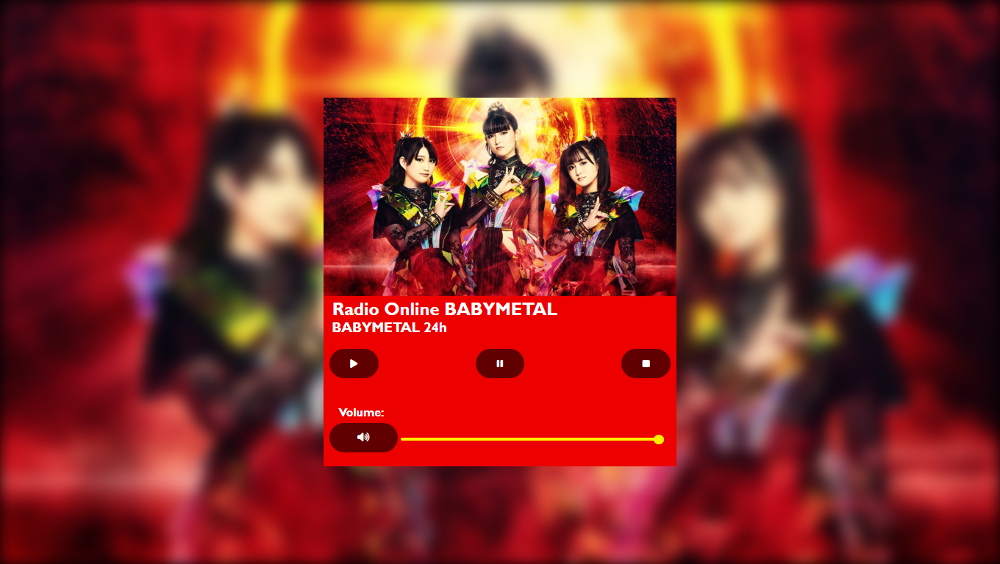

# Radio BABYMETAL Player

## Índice 

* [Descrição do Projeto](#descrição-do-projeto)
* [Status do Projeto](#status-do-Projeto)
* [Acesso ao Projeto](#acesso-ao-projeto)
* [Linguagens Utilizadas](#linguagens-Utilizadas)
* [Links do Autor](#links-do-autor)

## Descrição do Projeto

 Player de rádio online feito usando o link de uma estação de rádio online hospedada no [Zeno.FM](https://zeno.fm/). A estação utilizada exibe músicas da banda japonesa BABYMETAL.

## Status do Projeto

Sujeito a atualizações.

## Acesso ao Projeto

 - [Link para acessar o projeto.](https://douglasreis98.github.io/radio-babymetal_player/)
 - [Link para acessar o código-fonte.](https://github.com/DouglasReis98/radio-babymetal_player)

## Linguagens Utilizadas

- HTML5
- CSS3
- JavaScript

## Links do Autor

- Website - [Douglas Reis](http://douglasreis.epizy.com)
- Repositório - [DouglasReis98](https://github.com/DouglasReis98)
- LinkedIn - [@douglas-reis98](https://www.linkedin.com/in/douglas-reis98/)